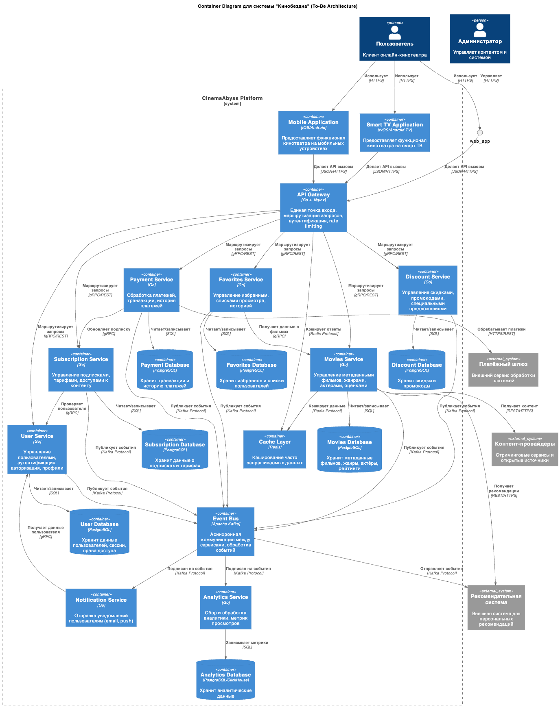
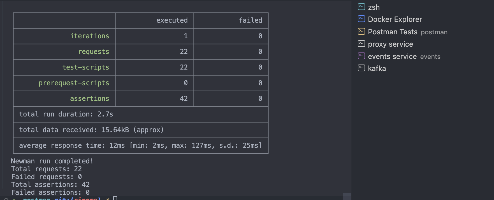
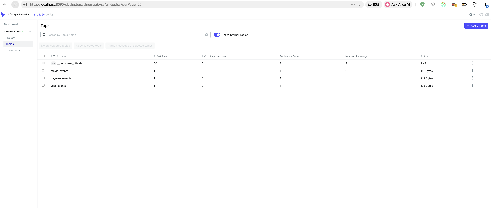
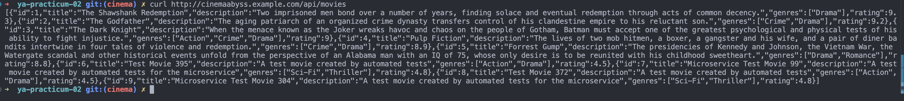
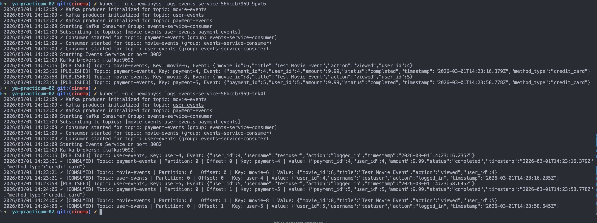
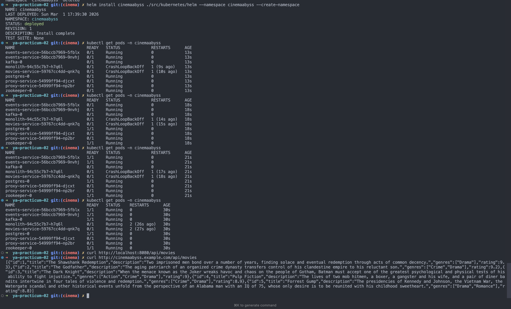
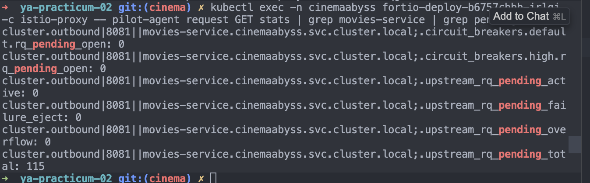
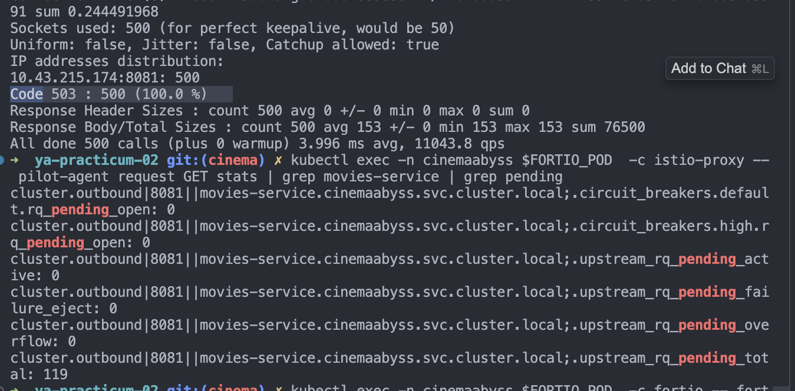

## Изучите [README.md](README.md) файл и структуру проекта.

## Задание 1

[Диаграмма контейнеров C4 (PlantUML)](./architecture/to-be-c4-container.puml)



## Задание 2

### 1. Proxy
Реализован прокси
Протестирован постепенный переход 
MOVIES_MIGRATION_PERCENT=50%
```bash
➜  ya-practicum-02 docker attach cinemaabyss-proxy-service
2026/02/28 12:52:06 [monolith] GET /health -> http://monolith:8080
2026/02/28 12:52:06 [movies-service] GET /api/movies -> http://movies-service:8081
2026/02/28 12:52:06 [monolith] GET /api/movies -> http://monolith:8080
2026/02/28 12:52:07 [movies-service] GET /api/movies -> http://movies-service:8081
2026/02/28 12:52:07 [monolith] GET /api/movies -> http://monolith:8080
2026/02/28 12:52:08 [monolith] GET /api/movies -> http://monolith:8080
2026/02/28 12:52:09 [monolith] GET /api/movies -> http://monolith:8080
2026/02/28 12:52:09 [movies-service] GET /api/movies -> http://movies-service:8081
2026/02/28 12:52:10 [movies-service] GET /api/movies -> http://movies-service:8081
2026/02/28 12:52:10 [movies-service] GET /api/movies -> http://movies-service:8081
2026/02/28 12:52:11 [movies-service] GET /api/movies -> http://movies-service:8081
2026/02/28 12:52:11 [monolith] GET /api/users -> http://monolith:8080
2026/02/28 12:52:11 [monolith] GET /api/payments -> http://monolith:8080
```

MOVIES_MIGRATION_PERCENT=100%
```bash
➜  ya-practicum-02 git:(cinema) ✗ docker logs cinemaabyss-proxy-service
2026/02/28 12:55:59 Starting Proxy Service (API Gateway) on port 8000
2026/02/28 12:55:59 Monolith URL: http://monolith:8080
2026/02/28 12:55:59 Movies Service URL: http://movies-service:8081
2026/02/28 12:55:59 Events Service URL: http://events-service:8082
2026/02/28 12:55:59 Gradual Migration: true
2026/02/28 12:55:59 Movies Migration Percent: 100%
2026/02/28 12:56:07 Starting Proxy Service (API Gateway) on port 8000
2026/02/28 12:56:07 Monolith URL: http://monolith:8080
2026/02/28 12:56:07 Movies Service URL: http://movies-service:8081
2026/02/28 12:56:07 Events Service URL: http://events-service:8082
2026/02/28 12:56:07 Gradual Migration: true
2026/02/28 12:56:07 Movies Migration Percent: 100%
2026/02/28 12:56:42 [monolith] GET /health -> http://monolith:8080
2026/02/28 12:56:42 [movies-service] GET /api/movies -> http://movies-service:8081
2026/02/28 12:56:43 [movies-service] GET /api/movies -> http://movies-service:8081
2026/02/28 12:56:43 [movies-service] GET /api/movies -> http://movies-service:8081
2026/02/28 12:56:44 [movies-service] GET /api/movies -> http://movies-service:8081
2026/02/28 12:56:44 [movies-service] GET /api/movies -> http://movies-service:8081
2026/02/28 12:56:45 [movies-service] GET /api/movies -> http://movies-service:8081
2026/02/28 12:56:46 [movies-service] GET /api/movies -> http://movies-service:8081
2026/02/28 12:56:46 [movies-service] GET /api/movies -> http://movies-service:8081
2026/02/28 12:56:47 [movies-service] GET /api/movies -> http://movies-service:8081
2026/02/28 12:56:47 [movies-service] GET /api/movies -> http://movies-service:8081
2026/02/28 12:56:48 [monolith] GET /api/users -> http://monolith:8080
2026/02/28 12:56:48 [monolith] GET /api/payments -> http://monolith:8080
```

### 2. Kafka

Разработан сервис
Тесты прошли 



## Задание 3

Результат вызоыв api/movies


Логи events-servise


## Задание 4

helm 


# Задание 5

```bash
ya-practicum-02 git:(cinema) ✗ helm repo add istio https://istio-release.storage.googleapis.com/charts
"istio" has been added to your repositories
➜  ya-practicum-02 git:(cinema) ✗ helm repo update
Hang tight while we grab the latest from your chart repositories...
...Successfully got an update from the "istio" chart repository
Update Complete. ⎈Happy Helming!⎈
➜  ya-practicum-02 git:(cinema) ✗ helm install istio-base istio/base -n istio-system --set defaultRevision=default --create-namespace
NAME: istio-base
LAST DEPLOYED: Sun Mar  1 17:43:25 2026
NAMESPACE: istio-system
STATUS: deployed
REVISION: 1
DESCRIPTION: Install complete
TEST SUITE: None
NOTES:
Istio base successfully installed!

To learn more about the release, try:
  $ helm status istio-base -n istio-system
  $ helm get all istio-base -n istio-system
➜  ya-practicum-02 git:(cinema) ✗ helm install istio-ingressgateway istio/gateway -n istio-system
NAME: istio-ingressgateway
LAST DEPLOYED: Sun Mar  1 17:43:32 2026
NAMESPACE: istio-system
STATUS: deployed
REVISION: 1
DESCRIPTION: Install complete
TEST SUITE: None
NOTES:
"istio-ingressgateway" successfully installed!

To learn more about the release, try:
  $ helm status istio-ingressgateway -n istio-system
  $ helm get all istio-ingressgateway -n istio-system

Next steps:
  * Deploy an HTTP Gateway: https://istio.io/latest/docs/tasks/traffic-management/ingress/ingress-control/
  * Deploy an HTTPS Gateway: https://istio.io/latest/docs/tasks/traffic-management/ingress/secure-ingress/
➜  ya-practicum-02 git:(cinema) ✗ helm install istiod istio/istiod -n istio-system --wait
NAME: istiod
LAST DEPLOYED: Sun Mar  1 17:43:38 2026
NAMESPACE: istio-system
STATUS: deployed
REVISION: 1
DESCRIPTION: Install complete
TEST SUITE: None
NOTES:
"istiod" successfully installed!

To learn more about the release, try:
  $ helm status istiod -n istio-system
  $ helm get all istiod -n istio-system

Next steps:
  * Deploy a Gateway: https://istio.io/latest/docs/setup/additional-setup/gateway/
  * Try out our tasks to get started on common configurations:
    * https://istio.io/latest/docs/tasks/traffic-management
    * https://istio.io/latest/docs/tasks/security/
    * https://istio.io/latest/docs/tasks/policy-enforcement/
  * Review the list of actively supported releases, CVE publications and our hardening guide:
    * https://istio.io/latest/docs/releases/supported-releases/
    * https://istio.io/latest/news/security/
    * https://istio.io/latest/docs/ops/best-practices/security/

For further documentation see https://istio.io website
ya-practicum-02 git:(cinema) ✗ helm install cinemaabyss ./src/kubernetes/helm --namespace cinemaabyss --create-namespace
NAME: cinemaabyss
LAST DEPLOYED: Sun Mar  1 17:48:59 2026
NAMESPACE: cinemaabyss
STATUS: deployed
REVISION: 1
DESCRIPTION: Install complete
TEST SUITE: None
➜  ya-practicum-02 git:(cinema) ✗ kubectl label namespace cinemaabyss istio-injection=enabled --overwrite
namespace/cinemaabyss labeled
➜  ya-practicum-02 git:(cinema) ✗ kubectl get namespace -L istio-injection
NAME              STATUS   AGE     ISTIO-INJECTION
cinemaabyss       Active   14s     enabled
default           Active   15m     
ingress-nginx     Active   13m     
istio-system      Active   5m47s   
kube-node-lease   Active   15m     
kube-public       Active   15m     
kube-system       Active   15m     
➜  ya-practicum-02 git:(cinema) ✗ kubectl rollout restart deployment monolith -n cinemaabyss
deployment.apps/monolith restarted
➜  ya-practicum-02 git:(cinema) ✗ kubectl rollout restart deployment movies-service -n cinemaabyss
deployment.apps/movies-service restarted
➜  ya-practicum-02 git:(cinema) ✗ kubectl get pods -n cinemaabyss
NAME                              READY   STATUS     RESTARTS      AGE
events-service-56bccb7969-9xc9t   1/1     Running    0             38s
events-service-56bccb7969-glttb   1/1     Running    0             38s
kafka-0                           1/1     Running    0             38s
monolith-6697f78d8-vskfv          0/2     Init:0/1   0             9s
monolith-94c55c7b7-zrvrx          1/1     Running    2 (35s ago)   38s
movies-service-57675db7b7-rkjsq   0/2     Init:0/1   0             4s
movies-service-59767cc4dd-xfbwd   1/1     Running    2 (35s ago)   38s
postgres-0                        1/1     Running    0             38s
proxy-service-54999ff94-8k82f     0/1     Running    0             38s
proxy-service-54999ff94-x29dk     1/1     Running    0             38s
zookeeper-0                       1/1     Running    0             38s
➜  ya-practicum-02 git:(cinema) ✗ kubectl get pods -n cinemaabyss
NAME                              READY   STATUS    RESTARTS      AGE
events-service-56bccb7969-9xc9t   1/1     Running   0             2m12s
events-service-56bccb7969-glttb   1/1     Running   0             2m12s
kafka-0                           1/1     Running   0             2m12s
monolith-6697f78d8-vskfv          2/2     Running   1 (91s ago)   103s
movies-service-57675db7b7-rkjsq   2/2     Running   1 (91s ago)   98s
postgres-0                        1/1     Running   0             2m12s
proxy-service-54999ff94-8k82f     1/1     Running   0             2m12s
proxy-service-54999ff94-x29dk     1/1     Running   0             2m12s
zookeeper-0                       1/1     Running   0             2m12s
➜  ya-practicum-02 git:(cinema) ✗ 
ya-practicum-02 git:(cinema) ✗ kubectl apply -f ./src/kubernetes/circuit-breaker-config.yaml -n cinemaabyss
Warning: outlier detection consecutive errors is deprecated, use consecutiveGatewayErrors or consecutive5xxErrors instead
destinationrule.networking.istio.io/monolith-circuit-breaker created
destinationrule.networking.istio.io/movies-service-circuit-breaker created
➜  ya-practicum-02 git:(cinema) ✗ kubectl get destinationrule -n cinemaabyss
NAME                             HOST                                           AGE
monolith-circuit-breaker         monolith.cinemaabyss.svc.cluster.local         7s
movies-service-circuit-breaker   movies-service.cinemaabyss.svc.cluster.local   7s
➜  ya-practicum-02 git:(cinema) ✗ kubectl describe destinationrule monolith-circuit-breaker -n cinemaabyss
Name:         monolith-circuit-breaker
Namespace:    cinemaabyss
Labels:       <none>
Annotations:  <none>
API Version:  networking.istio.io/v1
Kind:         DestinationRule
Metadata:
  Creation Timestamp:  2026-03-01T14:52:02Z
  Generation:          1
  Resource Version:    3534
  UID:                 b8a13d3c-1903-4226-a760-4c76480cd4b8
Spec:
  Host:  monolith.cinemaabyss.svc.cluster.local
  Traffic Policy:
    Connection Pool:
      Http:
        http1MaxPendingRequests:      50
        http2MaxRequests:             100
        Max Requests Per Connection:  10
      Tcp:
        Max Connections:  100
    Outlier Detection:
      Base Ejection Time:    30s
      Consecutive Errors:    5
      Interval:              30s
      Max Ejection Percent:  50
      Min Health Percent:    50
Events:                      <none>
➜  ya-practicum-02 git:(cinema) ✗ kubectl describe destinationrule movies-service-circuit-breaker -n cinemaabyss
Name:         movies-service-circuit-breaker
Namespace:    cinemaabyss
Labels:       <none>
Annotations:  <none>
API Version:  networking.istio.io/v1
Kind:         DestinationRule
Metadata:
  Creation Timestamp:  2026-03-01T14:52:02Z
  Generation:          1
  Resource Version:    3535
  UID:                 572acc88-f370-4379-868b-ce13668fdb9b
Spec:
  Host:  movies-service.cinemaabyss.svc.cluster.local
  Traffic Policy:
    Connection Pool:
      Http:
        http1MaxPendingRequests:      50
        http2MaxRequests:             100
        Max Requests Per Connection:  10
      Tcp:
        Max Connections:  100
    Outlier Detection:
      Base Ejection Time:    30s
      Consecutive Errors:    3
      Interval:              20s
      Max Ejection Percent:  50
      Min Health Percent:    50
Events:                      <none>
➜  ya-practicum-02 git:(cinema) ✗ 
```

Тестирование
[log](./cb-test.log)



опустил сервис movies-service
